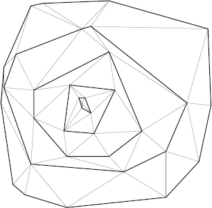

# Point triangulation using Graham’s scan
C++ implementation of triangulation algorithm based on the paper:
*  V. Tereshchenko,  Y. Tereshchenko and  D. Kotsur, ["Point triangulation using Graham’s scan"](https://ieeexplore.ieee.org/document/7173370/)

  

## Contributors:
* Vasyl Tereshchenko
* Yaroslav Tereshchenko
* Dmytro Kotsur

## License
This project is licensed under the MIT License - see the [LICENSE.md](LICENSE.md) file for details
